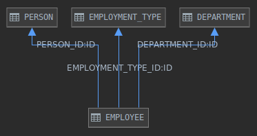

## The assignment

You will work with simple HR application that tracks information about their employees. You will be given a database structure with sample data, which will be loaded into in-memory H2 instance on application start. The database schema can be described as this:

Project is implemented in Spring Boot and you will need to implement functionality to retrieve information from three REST endpoints, namely:

	GET /employee/{id}
	GET /employee/active
	GET /employee/active/by-department

> Note: employee is active when he does not have END_DATE set in EMPLOYEE table

## What is expected in solution

- implementation based on the API description using standard approach (separation of concerns, layering, error handling, etc.)
- tests for the implementation must be written
- public methods must have proper `JavaDoc`
- application can be run on port `4444` (as defined in `application.properties`) without any issues
  
